# Terraform Azurerm VirtualNetwork Module

## Overview

This module creates secure Azure virtual networks with **private networking by default**. It automatically configures private endpoints and DNS zones when enabled to do so to keep your Azure services accessible only within your VNet, eliminating exposure to the public internet while maintaining the flexibility to enable public access when needed.

## Table of Contents

- [Module Scope & Integration](#module-scope--integration)
- [What this module contains](#what-this-module-contains)
- [Network Architecture Overview](#network-architecture-overview)
- [Architecture Diagrams](#architecture-diagrams)
- [Usage Guide](#usage-guide)
  - [Input Requirements by Feature](#input-requirements-by-feature)
  - [Complete Working Example](#complete-working-example)
- [Supported Azure Services](#supported-azure-services)
- [Migration Guide](#migration-guide)
  - [Moving from Public to Private Access](#moving-from-public-to-private-access)
- [Troubleshooting](#troubleshooting)
  - [DNS Resolution Issues](#dns-resolution-issues)
  - [Private Endpoint Not Working](#private-endpoint-not-working)
  - [Shared DNS Zone Conflicts](#shared-dns-zone-conflicts)
  - [Module Not Creating Expected Resources](#module-not-creating-expected-resources)

## Module Scope & Integration

This module focuses on **core private networking** and integrates well with other Azure networking components that you manage separately:

**✅ Directly Created:**
- Virtual Networks, Subnets, NSGs
- Private Endpoints & Private DNS Zones
- DNS Zone Virtual Network Links

**🔗 Supports but Not Created:**
- **VNet Peering** - Module creates peering-ready VNets with proper DNS zone sharing
- **Azure Firewall** - VNets work with hub-spoke topologies and firewall routing
- **VPN/ExpressRoute Gateways** - Compatible with hybrid connectivity scenarios  
- **Application Gateways** - Supports private application delivery patterns
- **Load Balancers** - Works with both internal and external load balancing

*Use this module as your secure networking foundation, then add these components as needed for your specific architecture.*

## What this module contains

| Network Resources | Purpose | Optional | What Happens When Not Configured |
|:----------|:----------|:----------|:----------|
| 🌐 **Virtual Network** | Creates an isolated network foundation with custom address space | ❌ | **Required** - Module will fail without this |
| 📶 **Subnets** | Creates subnets for organizing resources (workloads, endpoints, services) | ✅ | VNet created with no subnets |
| 🛡️ **NSG** | Network Security Groups with customizable inbound/outbound rules | ✅ | Empty NSGs (allow all internal traffic) |
| 🔒 **Private Endpoints** | Secure private connectivity to Azure services (Storage Accounts, CosmosDB, App Service, Key Vault etc.) | ✅ | VNet has no private connectivity to Azure services |
| 📡 **Private DNS Zones** | Auto-discovers and creates DNS zones for private endpoint resolution | ✅ | No DNS zones created if `create_dns_zones = false` is provided |
| 🔗 **DNS Zone Links** | Links private DNS zones to VNet for internal name resolution | ✅ | No DNS zone links created |
| 🌍 **Shared DNS Support** | Option to use existing DNS zones across multiple VNets | ✅ | 	Each VNet creates its own DNS zones |

## Network Architecture Overview

This module enables **hybrid networking patterns** that support both private and public access patterns for Azure resources:

### 🔒 **Private Networking (Recommended)**
- **Internal VNet Communication**: Resources within subnets communicate privately using Azure's backbone network
- **Private Endpoints**: Secure, private connectivity to Azure services (Storage, Key Vault, etc.) via dedicated network interfaces
- **Private DNS Resolution**: Auto-discovered DNS zones ensure internal traffic resolves to private IP addresses
- **No Internet Exposure**: Traffic remains within Azure's private network infrastructure

### 🌐 **Public Access (When Enabled)**
- **Dual Access Patterns**: Azure resources can simultaneously support both private and public endpoints
- **Public DNS Path**: External clients use public DNS to resolve to internet-routable endpoints
- **RBAC Protection**: Azure role-based access control still applies regardless of network path
- **Flexible Configuration**: Public access can be enabled/disabled per resource without affecting private connectivity

### 🏗️ **Shared Infrastructure**
- **DNS Zone Sharing**: Multiple VNets can share private DNS zones, avoiding conflicts and enabling cross-VNet resolution
- **No Circular Dependencies**: Clean one-way dependency model where dependent VNets reference shared DNS zones
- **Automatic Linking**: Each VNet automatically creates its own virtual network links to shared DNS zones

## Architecture Diagrams

This diagram illustrates how the module creates secure private networking with automatic DNS resolution:

```mermaid
flowchart TD
    subgraph Azure["Azure Subscription"]
        direction TB
        
        subgraph RG["Resource Group"]
            direction TB
            
            subgraph VNet["Virtual Network 10.0.0.0/16"]
                direction TB
                WorkloadSubnet["Workload Subnet<br/>10.0.1.0/24<br/>App VMs & Containers"]
                EndpointSubnet["Private Endpoint Subnet<br/>10.0.2.0/24<br/>Azure Service NICs"]
                
                subgraph NSG["Network Security Groups"]
                    NSGRules["Security Rules<br/>• Allow internal traffic<br/>• Block external access"]
                end
            end
            
            subgraph PEs["Private Endpoints"]
                direction TB
                StoragePE["Storage Account PE<br/>IP: 10.0.2.4"]
                KeyVaultPE["Key Vault PE<br/>IP: 10.0.2.5"]
                SqlPE["SQL Database PE<br/>IP: 10.0.2.6"]
            end
            
            subgraph DNS["Private DNS Zones"]
                direction TB
                BlobDNS["privatelink.blob.core.windows.net<br/>Auto-discovered"]
                VaultDNS["privatelink.vaultcore.azure.net<br/>Auto-discovered"]
                SqlDNS["privatelink.database.windows.net<br/>Auto-discovered"]
            end
        end
        
        subgraph Services["Azure Services"]
            direction TB
            StorageAccount["Storage Account<br/>Public access DISABLED"]
            KeyVault["Key Vault<br/>Public access DISABLED"]
            SqlDatabase["SQL Database<br/>Public access DISABLED"]
        end
    end
    
    %% Traffic Flow
    WorkloadSubnet -.->|"Private Traffic"| StoragePE
    WorkloadSubnet -.->|"Private Traffic"| KeyVaultPE
    WorkloadSubnet -.->|"Private Traffic"| SqlPE
    
    %% Private Endpoint Connections
    StoragePE ==>|"Secure Connection"| StorageAccount
    KeyVaultPE ==>|"Secure Connection"| KeyVault
    SqlPE ==>|"Secure Connection"| SqlDatabase
    
    %% DNS Resolution
    BlobDNS -.->|"Resolves to"| StoragePE
    VaultDNS -.->|"Resolves to"| KeyVaultPE
    SqlDNS -.->|"Resolves to"| SqlPE
    
    %% Subnet Placement
    EndpointSubnet -.-> StoragePE
    EndpointSubnet -.-> KeyVaultPE
    EndpointSubnet -.-> SqlPE
    
    %% NSG Protection
    NSGRules -.->|"Protects"| WorkloadSubnet
    NSGRules -.->|"Protects"| EndpointSubnet
    
    %% Styling with green/blue theme
    classDef vnet fill:#e8f5e8,stroke:#2e7d32,stroke-width:3px,color:#1b5e20
    classDef subnet fill:#e3f2fd,stroke:#1976d2,stroke-width:2px,color:#0d47a1
    classDef pe fill:#e8f5e8,stroke:#388e3c,stroke-width:2px,color:#1b5e20
    classDef dns fill:#e1f5fe,stroke:#0288d1,stroke-width:2px,color:#01579b
    classDef service fill:#f3e5f5,stroke:#7b1fa2,stroke-width:2px,color:#4a148c
    classDef nsg fill:#fff3e0,stroke:#f57f17,stroke-width:2px,color:#e65100
    
    class VNet vnet
    class WorkloadSubnet,EndpointSubnet subnet
    class StoragePE,KeyVaultPE,SqlPE pe
    class BlobDNS,VaultDNS,SqlDNS dns
    class StorageAccount,KeyVault,SqlDatabase service
    class NSG,NSGRules nsg
```



### 🔄 **Traffic Flow Explained:**

1. **🚀 Application Request**: Workload in subnet attempts to access `mystorageaccount.blob.core.windows.net`
2. **📡 DNS Resolution**: Private DNS zone resolves to private endpoint IP (10.0.2.4) instead of public IP
3. **🔒 Private Routing**: Traffic routes through private endpoint within the VNet
4. **🎯 Secure Access**: Private endpoint forwards traffic securely to Azure service
5. **🛡️ No Public Internet Exposure**: Traffic never leaves Azure's private backbone network

### Multi-VNet Shared DNS Example:


**🎯 Key Benefits Illustrated:**
- **🔒 Zero Internet Exposure** - All traffic stays within Azure private network
- **📡 Automatic DNS** - Module discovers and creates appropriate DNS zones
- **🌍 Cross-VNet Resolution** - Shared DNS enables service discovery between VNets  
- **🛡️ Defense in Depth** - NSGs + Private endpoints + Disabled public access
- **⚡ Performance** - Private backbone routing for optimal latency

## Usage Guide

### Input Requirements by Feature

| Feature | Required | Optional |
|:--------|:---------|:---------|
| 🌐 **Basic VNet** | `system_name`, `environment`, `resource_group`, `address_space` | `dns_servers`, `tags` |
| 📶 **Subnets** | `subnet_configs` | `private_endpoint_network_policies` |
| 🔒 **Private Endpoints** | `private_endpoint_configs`, `create_dns_zones = true` | `private_dns_zone_group` |
| 🌍 **Shared DNS** | `create_dns_zones = false`, `shared_dns_zone_ids` | - |

### Complete Working Example
```terraform
resource "azurerm_resource_group" "example" {
  name     = "rg-example-dev"
  location = "West Europe"
}

resource "azurerm_storage_account" "example" {
  name                     = "saexampledev123"
  resource_group_name      = azurerm_resource_group.example.name
  location                 = azurerm_resource_group.example.location
  account_tier             = "Standard"
  account_replication_type = "LRS"
  
  public_network_access_enabled = false
}

module "vnet" {
  source = "./modules/terraform-azurerm-virtualnetwork"
  
  vnet_canonical_name = "my-vnet"
  system_name         = "example"
  environment         = "dev"
  resource_group      = azurerm_resource_group.example
  address_space       = ["10.0.0.0/16"]
  dns_servers         = []
  
  subnet_configs = {
    workloads = cidrsubnet("10.0.0.0/16", 8, 1)
    endpoints = cidrsubnet("10.0.0.0/16", 8, 2)
  }

  nsg_attached_subnets = []
  
  create_dns_zones = true
  
  # Automatic DNS zone creation for PE
  private_endpoint_configs = {
    storage_blob = {
      subnet_name       = "endpoints"
      resource_id       = azurerm_storage_account.example.id
      subresource_names = ["blob"]
    }
  }

  # Manual DNS zone creation for PE
  private_endpoint_configs = {
    some_service = {
      subnet_name       = "endpoints"
      resource_id       = azurerm_storage_account.example.id
      subresource_names = ["customSubresource"]

      private_dns_zone_group = {
        name = "custom-service-dns"
        private_dns_zone_ids = [
          "privatelink.yourService.example.com"
        ]
      }
    }
  }
}
```

## Supported Azure Services

This module auto-discovers DNS zones for supported Azure services. For a complete list of supported subresources and their corresponding DNS zones, see [`azure_private_link_zones.tf`](./azure_private_link_zones.tf). <br>
If your Azure Service is not listed in the terraform document, you can find the correct DNS zone value on [`learn.microsoft.com/private-endpoint-dns`](https://learn.microsoft.com/en-us/azure/private-link/private-endpoint-dns) and manually pass the correct DNS zone through the DNS config variable.

**Common supported services include:**
- Storage (blob, file, queue, table, dfs)
- Key Vault (vault)
- SQL Database (sqlServer)
- Cosmos DB (sql, mongodb, cassandra)
- Container Registry (registry)

## Migration Guide

### Moving from Public to Private Access

**Step 1:** Deploy the module with private endpoints
```terraform
module "vnet" {
  # ... basic configuration
  create_dns_zones = true
  private_endpoint_configs = {
    storage_blob = {
      subnet_name       = "endpoints"
      resource_id       = azurerm_storage_account.existing.id
      subresource_names = ["blob"]
    }
  }
}
```

**Step 2:** Update your Azure resource to disable public access
```terraform
resource "azurerm_storage_account" "existing" {
  # ... existing configuration
  public_network_access_enabled = false  # Add this line
}
```

**Step 3:** Update application connection strings to use private endpoints

## Troubleshooting

### DNS Resolution Issues
- **Problem**: Can't connect to private endpoint
- **Solution**: Ensure VNet is linked to private DNS zone (auto-created by module)

### Private Endpoint Not Working
- **Problem**: Traffic still going to public endpoint
- **Solution**: Verify `public_network_access_enabled = false` on Azure resource

### Shared DNS Zone Conflicts
- **Problem**: DNS zone already exists error
- **Solution**: Use `create_dns_zones = false` and `shared_dns_zone_ids` for subsequent VNets

### Module Not Creating Expected Resources
- **Problem**: Some resources missing after apply
- **Solution**: Check required inputs in the table above match your configuration
